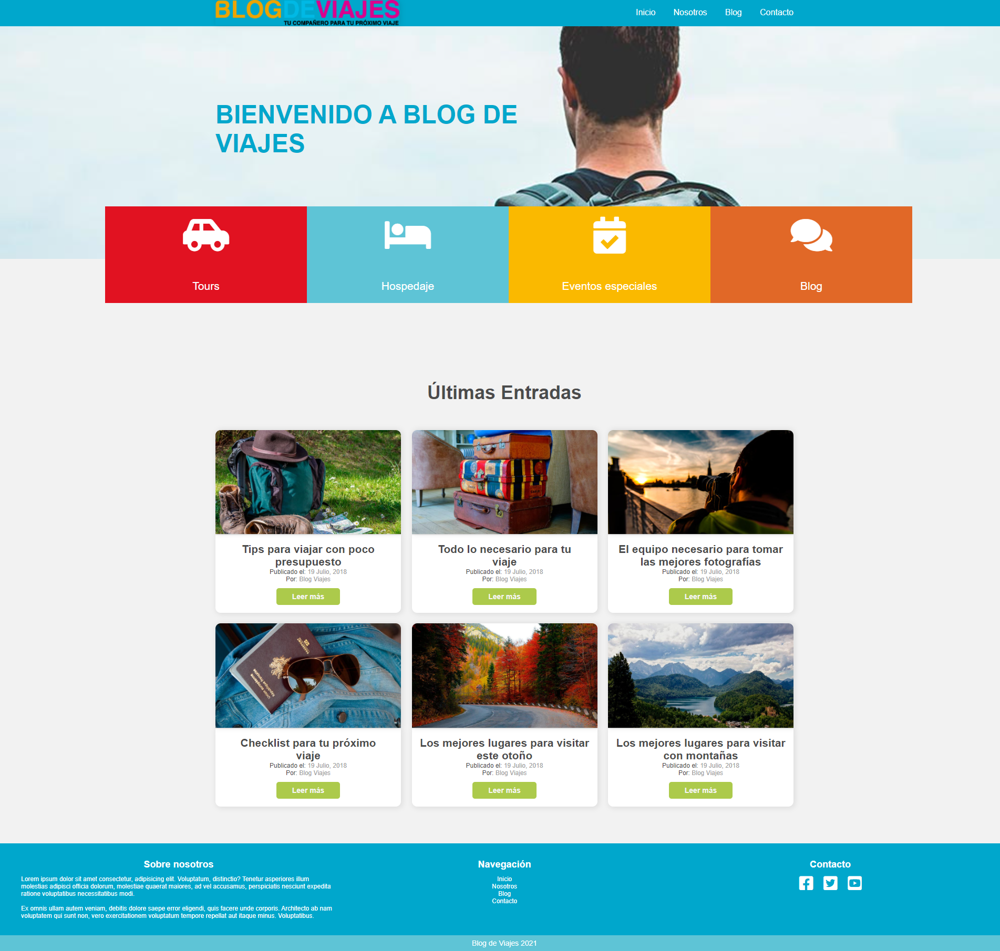

# Blog de viajes

I created a landing page for a simulated traveling company, using html and flexbox css.

## 🚀 Getting Started

<ul>You only need to open the .html file and you're set.</ul>

## 🎨 Preview

You can see the result here → [Blog de viajes](https://themattfire.github.io/Blog-de-viajes/).

  
 💻 Desktop version 

  

## 👩🏻‍💻 Technologies

1. HTML
2. CSS

Let me know what you think about it 😀
